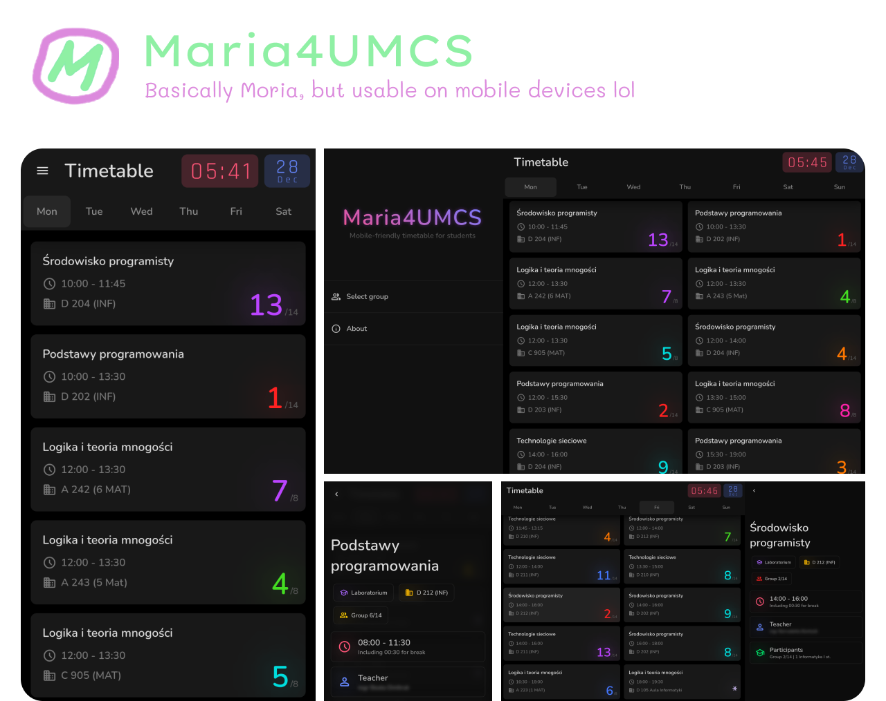

## Why

[moria.umcs.lublin.pl](http://moria.umcs.lublin.pl/) in terms of design, sucks at any screen.

It's hard to read and sometimes even impossible to check lesson's details (especially on mobile devices).

I created **Maria** to make my life easier and check the timetable faster with less chance for misreadings.

Why **Maria**? Because yes


## Installation

1. Download latest release from **[Releases page](https://github.com/dani3l0/maria4umcs)**

2. Make sure file has exec permission (`chmod +x maria4umcs`)

3. Just run it! (`./maria4umcs`)

**NOTE**: Backend acts just as reverse proxy for [Moria's API](http://moria.umcs.lublin.pl/api), nothing else


## Configuration

**via environment variables:**

- `MARIA_PORT` - set HTTP port you want to use; default is `3000`


## Build from source

Just clone the repo and run `make all`. Make sure you have `nodejs` and `golang` packages installed


```
git clone https://github.com/dani3l0/maria4umcs
cd maria4umcs
make all
```

Prebuilt executable file will be available in `dist` directory. It does not need `web` assets, those are already embedded.


## Develompent

Kinda tricky, but works. Just make sure you are using default ports and you're good to go.

```
# Firstly, build frontend so compilation won't crash
npm run build

# Run our reverse-proxy backend
go run .
```

```
# Run front-end with hot-reload
npm run dev
```

And, for testing please **connect to [localhost:5173](localhost:5173)** instead of :3000


## But... why there is backend?

Good question. **Moria's API does not send CORS headers**, thus we cannot fetch any data from different domain.

Let's say, we have a domain `maria.example.com` with Maria's frontend hosted. Sending a request to `moria.umcs.lublin.pl` will end with an error, because browser's policy disallows us to do so. It's a security feature preventing malicious cross-site scripting and other attacks.

To bypass this problem, we have a simple webserver which forwards our request to Moria's API (because backend easily can do this). Then, backend gets data from API and passess unchanged result straight to us. Brilliant, isn't it?

**Useful articles:**
- [MDN - Cross-Origin Resource Sharing](https://developer.mozilla.org/en-US/docs/Web/HTTP/CORS)
- [MDN - Content Security Policy (CSP)](https://developer.mozilla.org/en-US/docs/Web/HTTP/CSP)
